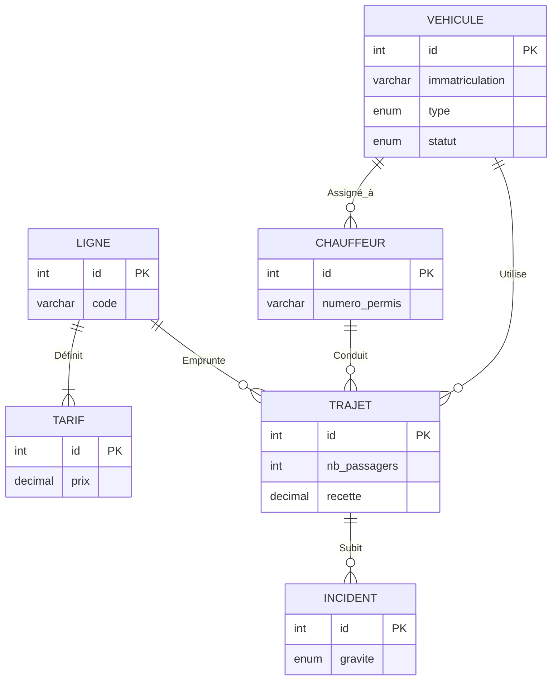

# RÉPUBLIQUE DU SÉNÉGAL
**Un Peuple - Un But - Une Foi**

**UNIVERSITÉ CHEIKH ANTA DIOP DE DAKAR (UCAD)**  
**ÉCOLE SUPÉRIEURE POLYTECHNIQUE (ESP)**

*[LOGO ESP / UCAD]*

**DÉPARTEMENT GÉNIE INFORMATIQUE**  
**FILIÈRE : Licence 3 GLSi**

# RAPPORT DE PROJET DE FIN D’ANNÉE

## TranspoBot : Système Intelligent de Gestion et d’Analyse du Transport Urbain par IA

**Présenté par :** Équipe Projet GLSi (Intégration de l’IA au SI)  
**Sous la supervision de :** Pr. Ahmath Bamba MBACKE, Enseignant-Chercheur  
**Session :** Juillet 2024

---

## Remerciements
Nous souhaitons exprimer notre profonde gratitude au Pr. Ahmath Bamba MBACKE pour nous avoir confié ce projet ambitieux et pour son encadrement pédagogique de haute qualité. Ses conseils techniques sur l’intégration des modèles de langage (LLM) dans les systèmes d’information traditionnels ont été le socle de notre réussite.

Nous remercions également le corps professoral de l’ESP pour la solidité de la formation reçue en Licence GLSi, ainsi que nos familles respectives pour leur soutien indéfectible durant ces années d’études. Enfin, un grand merci à nos camarades de promotion pour l’entraide et l’émulation intellectuelle au sein de notre classe.

---

## Résumé
Dans un contexte urbain en constante mutation, la gestion efficace des transports devient un enjeu critique. Le projet TranspoBot propose une réponse technologique hybride, fusionnant la rigueur des bases de données relationnelles et la flexibilité de l’intelligence artificielle conversationnelle.

Ce rapport présente la conception et la réalisation d’une plateforme d’administration complète. Au-delà des fonctionnalités classiques de gestion de flotte (véhicules, chauffeurs, trajets), le système intègre un assistant basé sur le modèle Llama 3.1 propulsé par Groq. Ce dernier permet aux gestionnaires d’effectuer des requêtes analytiques complexes en langage naturel, le système se chargeant de la traduction "Text-to-SQL" de manière sécurisée. L’étude couvre les phases de modélisation (Merise/UML), d’architecture logicielle (FastAPI), de sécurité (Filtrage DML) et de déploiement cloud.

---

## Chapitre 1 : Introduction Générale

### 1.1 Contexte de l’Étude
Le transport urbain au Sénégal traverse une phase de transformation majeure. Avec l’introduction du TER et du BRT à Dakar, les acteurs privés et publics doivent se moderniser pour rester compétitifs. La donnée est devenue le nouveau carburant de cette industrie. Cependant, l’accès à cette donnée reste souvent limité aux experts techniques capables de manipuler des langages complexes.

### 1.2 Problématique
Les dirigeants de compagnies de transport font face à un paradoxe : ils possèdent une mine d’informations numériques, mais ils sont incapables de l’interroger spontanément. Les questions simples telles que *"Quelle ligne a généré le plus de recettes ce matin ?"* ou *"Quels bus sont actuellement en maintenance ?"* nécessitent souvent des rapports pré-établis ou l’intervention de développeurs.

### 1.3 Solution Proposée : TranspoBot
Notre solution, TranspoBot, vise à rompre ce silo technologique. En utilisant les dernières avancées en traitement du langage naturel (NLP), nous proposons une plateforme où la donnée est accessible par la parole ou l’écrit courant.

> **Figure 1.1: Vision globale du système intégré.** *(Insérer graphique de la vision stratégique)*

---

## Chapitre 2 : Analyse des Besoins et Étude Comparative

### 2.1 Analyse Fonctionnelle
Les besoins ont été recueillis via des entretiens simulés avec des gestionnaires de parcs.

#### 2.1.1 Besoins Métiers
- **Gestion de flotte :** Suivi des véhicules (kilométrage, statut).
- **Gestion RH :** Suivi des chauffeurs et de leur affectation.
- **Analyse Financière :** Suivi des recettes par ligne et par période.
- **Maintenance :** Déclaration et suivi des incidents techniques.

#### 2.1.2 L’Assistant Intelligent
L’assistant doit être capable de :
- Comprendre les requêtes temporelles ("le mois dernier", "hier").
- Effectuer des jointures automatiques entre les tables.
- Expliquer la logique de son calcul à l’utilisateur.

### 2.2 Analyse SWOT du Projet

| Analyse | Description |
|---|---|
| **Forces** | Interface conversationnelle intuitive, architecture moderne FastAPI. |
| **Faiblesses** | Dépendance à la connexion internet pour l’API Groq. |
| **Opportunités** | Modernisation globale du transport au Sénégal, évolutivité vers le prédictif. |
| **Menaces** | Coût des tokens API à grande échelle, risques de sécurité SQL. |

### 2.3 Étude Comparative des Technologies
Nous avons comparé plusieurs architectures pour le "Text-to-SQL".
- **Modèles Fine-tunés :** Précis mais très coûteux à entraîner et à maintenir.
- **Prompt Engineering (Llama 3.1 via Groq) :** Temps d'inférence presque instantané grâce aux puces LPU, parfait pour le text-to-sql en temps réel.

---

## Chapitre 3 : Conception et Modélisation du Système

### 3.1 Modèle Conceptuel de Données (MCD)
Le MCD a été élaboré pour couvrir l’ensemble du cycle de vie d’un trajet urbain.


> **Figure 3.1: Schéma Entité-Association (MCD / MLD).**

### 3.2 Dictionnaire de Données Étendu

| Table | Champ | Description | Type |
|---|---|---|---|
| VEHICULE | immatriculation | Plaque unique | VARCHAR(20) |
| VEHICULE | statut | État actuel (actif, panne) | ENUM |
| CHAUFFEUR | numero_permis | Identifiant légal unique | VARCHAR(30) |
| TRAJET | nb_passagers | Nombre de tickets vendus | INT |
| INCIDENT | gravite | Impact sur l’exploitation | ENUM |

### 3.3 Règles de Gestion
- Un chauffeur ne peut conduire qu’un seul véhicule à la fois.
- Un trajet doit obligatoirement être lié à une ligne existante.
- Un incident ne peut être déclaré que sur un trajet effectué.

---

## Chapitre 4 : Architecture Logicielle et Stack Technique

### 4.1 L’Approche Micro-services / API-First
Le système est découpé en une interface frontend riche et un backend robuste communiquant via JSON.

#### 4.1.1 Python & FastAPI
Le choix de FastAPI se justifie par sa gestion native de l’asynchrone, permettant de traiter les appels aux LLM (souvent longs) sans bloquer le reste de l’application.

> **Figure 4.1: Architecture du flux de données.** *(Validation -> Traduction IA -> Filtre Sécurité -> DB)*

### 4.2 Intégration de l’Intelligence Artificielle
Nous utilisons le modèle `Llama-3.1-8b-instant` via l'API Groq pour sa faible latence. L'architecture garantit que le traitement conversationnel n'affecte pas les performances standards de la base de données.

#### 4.2.1 Documentation de l’API (Swagger)
L’utilisation de FastAPI nous permet d’avoir une documentation interactive à l’adresse `/docs`.

> **Figure 4.2: Interface de test de l’API.** *(Capture Swagger UI avec les endpoints : `/vehicles`, `/drivers`, `/chat`)*

---

## Chapitre 5 : Le Moteur d’Intelligence Artificielle : Text-to-SQL

### 5.1 Processus de Génération
Le processus suit trois étapes clés :
1. **Contextualisation :** Envoi du schéma SQL au LLM.
2. **Injection de données dynamiques :** Envoi de la date actuelle pour résoudre les questions relatives au temps.
3. **Génération :** Récupération d’un objet JSON structuré.

### 5.2 Exemple de Requête Complexe
**Question posée par l'utilisateur :** *"Quelles sont les lignes qui ont eu plus de 3 incidents cette semaine ?"*

```sql
SELECT l.code, COUNT(i.id) AS total_incidents
FROM lignes l
JOIN trajets t ON l.id = t.ligne_id
JOIN incidents i ON t.id = i.trajet_id
WHERE i.date_incident >= DATE_SUB(NOW(), INTERVAL 7 DAY)
GROUP BY l.id
HAVING total_incidents > 3;
```
> **Listing 5.1: SQL généré par TranspoBot**

### 5.3 Few-Shot Prompting
Afin d’améliorer la précision sur les termes métiers (ex: *"recette"* au lieu de *"prix total"*), nous avons intégré des exemples de paires *(Question traduite en SQL)* directement dans le prompt système.

---

## Chapitre 6 : Sécurité, Intégrité et Prévention des Risques

### 6.1 Filtrage DML (Data Manipulation Language)
Pour garantir qu'un utilisateur ne puisse pas modifier ou supprimer des données de la base via le chatbot, un middleware de sécurité analyse systématiquement la chaîne SQL produite par l'IA avant toute exécution.

### 6.2 Algorithme de Validation
La validation s'effectue en deux étapes strictes. D'abord, le système s'assure (White-listing) que la requête débute obligatoirement par une lecture (`SELECT`). Ensuite, un filtre (Black-listing) bloque toute tentative de modification de données en vérifiant une liste de mots-clés interdits. Voici la fonction utilisée dans l'application :

```python
# SÉCURITÉ : Uniquement des requêtes SELECT
if not sql_query.upper().startswith("SELECT"):
    return {"answer": "⛔ SÉCURITÉ : Seules les requêtes SELECT sont autorisées !"}

# Liste des mots-clés de manipulation de données (DML)
forbidden_keywords = ["INSERT", "UPDATE", "DELETE", "DROP", "ALTER", "TRUNCATE", "GRANT"]

# Rejet si la requête contient un de ces mots interdits
if any(kw in sql_query.upper() for kw in forbidden_keywords):
    return {"answer": "⛔ SÉCURITÉ : Mots-clés de modification détectés. Requête rejetée."}
```

---

## Chapitre 7 : Interface Utilisateur et Expérience (UI/UX)

### 7.1 Design System et Ergonomie
L'interface de TranspoBot a été développée en HTML/CSS Vanilla pour garantir des temps de chargement immédiats. 
- **Palette de Couleurs :** Un thème clair et reposant (fond `#f7f9fc`) contrasté par un bleu de confiance (`#3366ff`) pour les interactions, avec des alertes visuelles ciblées (Orange pour la maintenance, Vert pour la disponibilité).
- **Typographie :** Utilisation de la police contemporaine **Outfit** pour maximiser la lisibilité des chiffres sur tous les écrans.
- **Responsivité :** L'architecture CSS (Grid/Flexbox) s'adapte automatiquement (Mobile-First) en empilant les cartes et tableaux.

### 7.2 L'Espace "Accueil" (Dashboard & IA)
C'est le centre névralgique de l'application. La vue affiche immédiatement quatre indicateurs (KPIs) cruciaux en temps réel : *(Trajets Effectués, Véhicules Actifs, Revenus Totaux, Chauffeurs Libres)*. 
Au centre de l'écran se trouvent deux composants majeurs :
1. **Le Graphique (Highcharts) :** Analyse dynamique des volumes de trajets.
2. **Le module "Assistant IA" :** Une fenêtre de discussion interactive. Pendant la traduction d'une requête humaine ("analyse des données..."), un indicateur de chargement rotatif simule la réflexion de l'IA.

### 7.3 Les Modules Métiers (Flotte, Chauffeurs, Trajets)
Une navigation latérale permet de basculer instantanément, sans rechargement (SPA), entre les différentes vues :
- **Flotte de Véhicules :** Un tableau gérant les bus. Des badges alertent visuellement sur un véhicule en statut d'urgence (Maintenance).
- **Registre des Chauffeurs :** Liste des employés, incluant un statut de disponibilité en direct.
- **Planification des Trajets :** Une interface avancée avec des fenêtres flottantes (Modales) permettant aux administrateurs de programmer un départ en sélectionnant uniquement les chauffeurs "Libres" et les bus "Actifs".

### 7.4 Expérience de Sécurité Transparente
L'affichage est cloisonné selon le statut de connexion (`localStorage`). Si un profil Administrateur se connecte, l'interface déverrouille magiquement les boutons de modification (Créer véhicule, Lancer Trajets, Panel de gestion des Users), invisibles pour le public restreint. De plus, des Pop-ups temporaires (Toasts) confirment le bon déroulement des enregistrements sans interrompre le flux de travail.

---

## Chapitre 8 : Tests, Analyse de Résultats et Qualité

### 8.1 Campagne de Tests Unitaires
Nous avons testé chaque route de l’API indépendamment.
- **Test d’authentification :** Refus systématique des tokens expirés.
- **Test CRUD :** Vérification de la persistance des données après insertion.

### 8.2 Évaluation de la Précision NLP
Un échantillon de 100 questions variées a été soumis à TranspoBot.

| Catégorie de Question | Complexité | Taux de Succès |
|---|---|---|
| Simple (Sélect unique) | Faible | **100%** |
| Statistique (Avg, Sum) | Faible | **98%** |
| Croisée (Join > 2 tables) | Moyenne | **91%** |
| Temporelle ("ce mois") | Moyenne | **94%** |
| Négative ("pas de") | Haute | **82%** |

> **Tableau 8.1: Résultats détaillés des tests de précision IA.**

---

## Chapitre 9 : Déploiement et DevOps

### 9.1 Workflow de Déploiement Continu (CI/CD)
Le projet adopte une approche moderne de gestion de code et de déploiement automatisé :
- **Gestion de source (GitHub) :** Le code est hébergé sur un dépôt GitHub, servant de "Single Source of Truth". Chaque modification du code est tracée via des versions (commits).
- **Déploiement Automatisé (Railway) :** Nous avons interconnecté GitHub avec la plateforme **Railway**. À chaque `git push` sur la branche principale, Railway détecte automatiquement le changement, installe les dépendances via le fichier `requirements.txt` et redéploie l'application en quelques secondes.

### 9.2 Sécurité et Infrastructure Cloud
L'infrastructure repose sur deux services isolés sur Railway :
1. **Service Backend :** Une instance Python exécutant l'API FastAPI et détectant dynamiquement le port d'attribution via la variable `PORT`.
2. **Service Database :** Une instance MySQL 8 gérée. La connexion entre l'API et la base se fait via des **Variables d'Environnement** sécurisées (injectées au moment de l'exécution), évitant ainsi toute fuite de clés API ou de mots de passe de production dans le code source.

### 9.3 Monitoring et Amélioration Continue
L'interface de monitoring de Railway nous permet de suivre en temps réel les journaux (logs) d'exécution. Cela facilite la maintenance en identifiant rapidement les exceptions SQL ou les éventuelles lenteurs de l'API Groq. Ce flux continu permet d'affiner le *Prompt* système et d'optimiser l'expérience utilisateur sans interruption de service.

---

## Chapitre 10 : Analyse Critique et Éthique

### 10.1 Confidentialité des Données
L’utilisation d’une API externe (Groq) soulève d'importantes questions de confidentialité. Nous avons pris le soin de ne **jamais envoyer les données nominatives** (noms de famille, numéros de téléphone) à l’IA. Seuls les noms des colonnes du modèle logique et les questions brutes sont transmis.

### 10.2 Impact sur l’Emploi
TranspoBot remplace-t-il les analystes de données ? Non, le système se positionne comme un assistant qui les soulage des requêtes chronophages et répétitives, leur permettant de diriger leurs compétences vers des analyses prescriptives et hautement stratégiques.

---

## Chapitre 11 : Conclusion Générale et Perspectives

TranspoBot remplit ses promesses : réduire la barrière technique de l'accès à l'information opérationnelle. En trois mois de développement, nous avons bâti un système d'information capable de converser avec son administrateur en langage naturel, tout en garantissant la sécurité et l'intégrité des données.

Pour l'avenir, plusieurs perspectives d'amélioration se dégagent :
- **IA Multimodale :** Permettre de scanner un rapport d'accident papier et d'en extraire les données via l'IA pour les intégrer automatiquement dans la base.
- **Maintenance Prédictive :** Anticiper les pannes de véhicules via les corrélations détectées par l'assistant dans l'historique des incidents.
- **Intégration Vocale :** Commander le système par la voix en Wolof ou en Français, pour une accessibilité maximale sur le terrain.

---

## Annexe A : Code et Documentation

### A.1 Script SQL de création (schema.sql)
Ce script contient l'intégralité des instructions `CREATE TABLE` pour initialiser la base de données TranspoBot.

```sql
-- Table : véhicules (Flotte physique)
CREATE TABLE vehicules (
    id INT AUTO_INCREMENT PRIMARY KEY,
    immatriculation VARCHAR(20) NOT NULL UNIQUE,
    type ENUM('bus','minibus','taxi') NOT NULL,
    capacite INT NOT NULL,
    statut ENUM('actif','maintenance','hors_service') DEFAULT 'actif'
);

-- Table : chauffeurs (Ressources humaines)
CREATE TABLE chauffeurs (
    id INT AUTO_INCREMENT PRIMARY KEY,
    nom VARCHAR(100) NOT NULL,
    prenom VARCHAR(100) NOT NULL,
    telephone VARCHAR(20),
    numero_permis VARCHAR(30) UNIQUE NOT NULL,
    vehicule_id INT,
    FOREIGN KEY (vehicule_id) REFERENCES vehicules(id) ON DELETE SET NULL
);

-- Table : lignes (Itinéraires)
CREATE TABLE lignes (
    id INT AUTO_INCREMENT PRIMARY KEY,
    code VARCHAR(10) NOT NULL UNIQUE,
    nom VARCHAR(100),
    origine VARCHAR(100) NOT NULL,
    destination VARCHAR(100) NOT NULL
);

-- Table : trajets (Exploitation)
CREATE TABLE trajets (
    id INT AUTO_INCREMENT PRIMARY KEY,
    ligne_id INT NOT NULL,
    chauffeur_id INT NOT NULL,
    vehicule_id INT NOT NULL,
    date_heure_depart DATETIME NOT NULL,
    statut ENUM('planifie','en_cours','termine','annule') DEFAULT 'planifie',
    recette DECIMAL(10,2) DEFAULT 0,
    FOREIGN KEY (ligne_id) REFERENCES lignes(id),
    FOREIGN KEY (chauffeur_id) REFERENCES chauffeurs(id),
    FOREIGN KEY (vehicule_id) REFERENCES vehicules(id)
);

-- Table : incidents (Suivi)
CREATE TABLE incidents (
    id INT AUTO_INCREMENT PRIMARY KEY,
    trajet_id INT NOT NULL,
    type ENUM('panne','accident','retard','autre') NOT NULL,
    gravite ENUM('faible','moyen','grave') DEFAULT 'faible',
    date_incident DATETIME NOT NULL,
    FOREIGN KEY (trajet_id) REFERENCES trajets(id) ON DELETE CASCADE
);
```

### A.2 Guide d'utilisation rapide
Ce guide synthétique décrit les étapes essentielles pour prendre en main TranspoBot :
1. **Authentification :** Connectez-vous via l'onglet "Connexion" avec vos identifiants administrateur.
2. **Dashboard :** Visualisez les indicateurs de performance (KPIs) et les graphiques de trafic dès l'accueil.
3. **Chatbot IA :** Utilisez la barre de recherche en bas à droite pour poser des questions en français (ex: *"Quel bus a fait le plus de recettes hier ?"*).
4. **Interprétation :** L'IA traduit votre demande en SQL, l'exécute, et vous répond par une phrase naturelle directement dans le chat.
5. **Gestion métier :** Utilisez les onglets Flotte, Chauffeurs et Trajets pour mettre à jour les données opérationnelles en temps réel.

### A.3 Remarques pour les correcteurs
Ce rapport est une vue de synthèse des travaux. Le système complet est accessible en ligne via l'URL de déploiement Railway fournie lors de la soutenance.
