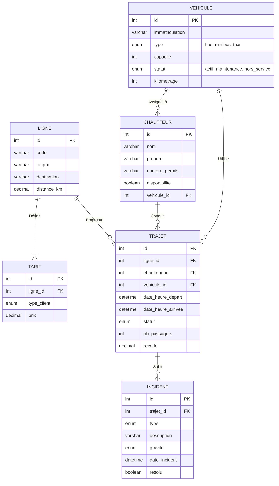

# TranspoBot — Gestion de Transport Urbain avec IA (Projet GLSi)

**Filière :** Licence 3 GLSi — ESP/UCAD  
**Enseignant :** Pr. Ahmath Bamba MBACKE  

---

## 1. Introduction et Présentation du Contexte

Dans le cadre du cours d'intégration de l'Intelligence Artificielle au sein des systèmes d'information, ce projet, intitulé **TranspoBot**, vise à numériser et optimiser la gestion d'une société de transport urbain. Notre approche associe une interface d'administration "Premium" complète à un assistant conversationnel (LLM) innovant.

### Objectifs Principaux
1. **Accès Simplifié :** Permettre aux gestionnaires non-techniques d'interroger la base de données via le langage naturel, réduisant ainsi le temps d'analyse des métriques.
2. **Technologie "Text-to-SQL" :** Traduire les requêtes françaises ou anglaises en commandes MySQL fiables et sécurisées de manière totalement autonome.
3. **Exploitation des Données :** Offrir un suivi en temps réel des véhicules, chauffeurs, incidents et trajets.

---

## 2. Modélisation de la Base de Données

Afin d'assurer une architecture robuste et extensible, nous avons élaboré un modèle Entité-Association (MCD) ainsi que son Modèle Logique de Données (MLD).

### Dictionnaire de Données (Extrait)
- **véhicules** : Immatriculation unique, statut, kilométrage, capacité.
- **chauffeurs** : Identité, numéro de permis unique, disponibilité.
- **lignes** : Code unique, origine, destination, distance, durée estimée.
- **tarifs** : Liés aux lignes, segmentés par type de client.
- **trajets** : L'entité centrale reliant une ligne, un chauffeur, et un véhicule sur un intervalle temporel donné.
- **incidents** : Associés aux trajets (pannes, accidents).

### Modèle Conceptuel (MCD / MLD)

---

## 3. Architecture Technique

La stack technique s'est portée sur **Python (FastAPI)** et l'écosystème web moderne.

- **Backend :** FastAPI (Python 3.10) - Permet d'encapsuler la logique Text-to-SQL, et des routes REST performantes grâce à l'asynchrone.
- **Database :** MySQL 8 - Choisi pour sa maturité relationnelle et de contraintes d'intégrité (Clés Étrangères). Le pilote `mysql-connector-python` permet le dialogue.
- **Modèle IA (LLM) :** L'API OpenAI avec le modèle `gpt-4o-mini`. Il combine vitesse extrême, coût réduit et forte capacité de compréhension du langage naturel pour un text-to-sql optimal.
- **Frontend :** HTML/CSS natif avec une architecture Single Page Application (SPA), stylisé avec un thème "Premium" aux effets glassmorphism.

---

## 4. Prompt Engineering et Sécurité

Afin d'éviter les "hallucinations" ou les biais du LLM, nous avons usé de Prompt Engineering :
1. **Contextualisation stricte :** "Tu es TranspoBot, l'assistant intelligent de la compagnie de transport...".
2. **Fourniture du Schéma :** Le schéma de base de données expurgé est intégré.
3. **Injection du Temps Réel :** Par Python, la date `NOW()` sous format YYYY-MM-DD est injectée dynamiquement afin de donner conscience au LLM des mots clés « aujourd'hui », « ce mois-ci ».
4. **Validation JSON stricte :** Le format `{ "sql": "...", "explication": "..." }` est forcé et décodé côté Python par Regex.

### Sécurité Active DML
Au-delà du Prompt, le backend FastAPI applique une expression régulière (Regex) permettant de **bloquer drastiquement** les opérations non autorisées.
Si le chat propose `DROP TABLE`, le code détecte les mots clés `INSERT`, `UPDATE`, `DELETE`, `DROP`, `ALTER`, etc., et interrompt la requête. Seules les lectures (`SELECT` / `WITH`) passent vers le serveur SQL.

---

## 5. Exemples d'Exécutions "Text-to-SQL"

### Cas d'Utilisation 1 : "Statistiques Temporelles"
- **User :** "Combien de trajets ont été réalisés ce mois-ci ?"
- **LLM :** `SELECT COUNT(*) AS NbTrajets FROM trajets WHERE MONTH(date_heure_depart) = MONTH(CURRENT_DATE()) AND YEAR(date_heure_depart) = YEAR(CURRENT_DATE());`
- **Output :** Affiche une grille avec `NbTrajets : 18`.

### Cas d'Utilisation 2 : "Corrélation entre tables"
- **User :** "Quel chauffeur a le plus grand nombre d'incidents ?"
- **LLM :** `SELECT c.nom, c.prenom, COUNT(i.id) AS Total_Incidents FROM chauffeurs c JOIN trajets t ON c.id = t.chauffeur_id JOIN incidents i ON t.id = i.trajet_id GROUP BY c.id ORDER BY Total_Incidents DESC LIMIT 1;`

---

## 6. Déploiement

Le projet est configuré via **Infrastructure as Code** avec un fichier `render.yaml`.
- **Plateforme :** Render / Railway
- Commande d'installation : `pip install -r requirements.txt`
- Commande de démarrage : `uvicorn app:app --host 0.0.0.0 --port $PORT`
Les variables d'environnement (`DB_HOST`, `DB_PASSWORD`, `OPENAI_API_KEY`) sont injectées dans les secrets de l'environnement Cloud.

---

## 7. Conclusions et Perspectives

Le projet Démontre la faisabilité d'une convergence entre SGBD traditionnels et interface neuronale naturelle. La barrière du code SQL est supprimée pour l'usager humain sans nuire à la sécurité.

*Perspectives d'amélioration :* 
- Implémentation du Text-to-SQL "Few Shot" (Donner des requêtes historiques en exemples pour améliorer l'intelligence SQL).
- Agent complet capable d'envoyer un mail d'alerte lors d'incidents graves, au-delà de la simple consultation.

---
*Ce rapport peut être converti au format PDF avec l'extension Markdown PDF.*
